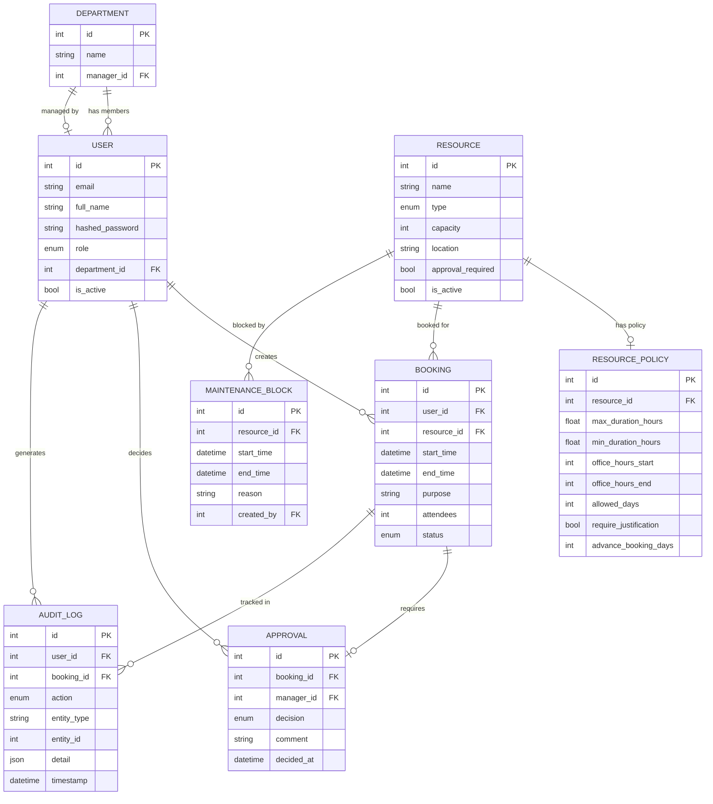

# Architecture

## Entity Relationship Diagram

---

## API Design Decisions

### Why SQLAlchemy + PostgreSQL (not NoSQL)?
Bookings have strong relational requirements (FKs, joins, transactions). PostgreSQL's MVCC ensures conflict-free concurrent booking reads/writes.

### Why separate `conflict_service` and `booking_service`?
Conflict detection logic is independently testable and reusable. If we add recurring bookings later, the conflict engine doesn't need to change.

### Why bitmask for `allowed_days`?
A 7-bit integer encodes all weekday rules in a single DB column, avoids arrays, and allows fast bitwise checks without any JOIN.

### JWT payload
We embed `user_id` and `role` in the token to avoid a DB lookup on every request. Role is validated against DB on actions that require current state (e.g. is_active check).

### Approval routing
When a booking requires approval, we look up `department.manager_id` at creation time. This means if a manager changes, old pending bookings still route to the previous manager. This is by design (audit integrity).

### Soft-delete for resources
Resources are deactivated (`is_active = False`) rather than deleted. This preserves historical booking records and audit logs.

---

## Tradeoffs

| Decision | Pros | Cons |
|---|---|---|
| Single approval per booking | Simple, predictable | No multi-level approval |
| Policy stored in DB (not code) | Admin-configurable at runtime | Slightly more complex service layer |
| JWT (stateless) | Scalable, no session store needed | Can't revoke tokens mid-flight |
| React + Vite | Fast dev, small bundle | SSR not included |
| react-query for server state | Auto-cache invalidation, stale-while-revalidate | Learning curve |
